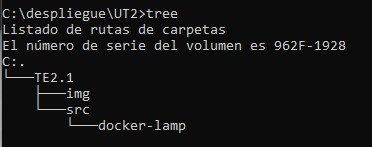

## Tarea Evaluable 2.1. Dockerización de stack LAMP

### Presentación

Tarea del módulo de Desarrollo Aplicaciones Web sobre Docker, desarrollada por:
- Sergio Holguera [GitHub](https://github.com/EdSerYo) [DockerHub](https://hub.docker.com/u/edseryo)


### Recursos previos

Se necesita tener instalado en el sistema DOCKER y Docker-compose. Para ello dirigirnos a la web oficial [DOCKER](https://www.docker.com/products/docker-desktop/) y descargar e instalar según version de nuestro sistema.

### Objetivos

- Conocer las ventajas que nos proporciona el uso de la tecnología de contenedores.
- Conocer los conceptos principales sobre el despliegue de aplicaciones web utilizando contenedores.
- Conocer los conceptos fundamentales sobre Docker.
- Trabajar con imágenes Docker.
- Trabajar con Docker y docker compose (orquestación de contenedores).
- Desplegar aplicaciones web sencillas en contenedores.

### Desarrollo

#### Paso 1. Descargar recursos.

En este paso crearemos y prepararemos una carpeta de trabajo. Para eso hacemos:
1. Crear una carpeta de trabajo llamada **"UT2/T2.1"** ya sea desde terminal con *"mkdir"* o desde el explorador de archivos con *"Nueva Carpeta"* y creamos la siguiente estructura de árbol.

     

2. Descargar el archivo [Recurso](https://github.com/jssfpciclos/DAW_daweb/blob/main/UT2/TE2.1/res/Tarea2.1.recursos.rar), copiarla a la carpeta de trabajo **"UT2/src/docker-lamp"** y la descomprimimos.

    

#### Paso 2. Imagen docker PHP

En este  paso vamos a crear una imagen Docker que incluya Apache y PHP, a partir de la imagen oficial de PHP 8.0.0 con Apache, e incluyendo el driver de MySQL para PHP. Para esto hay dos métodos. Construir una imagen paso a paso o con un **DOCKERFILE**. A continuación se desarrollará el método paso a paso.

##### Paso a paso #####

1. Descargar la imagen. Para ello utilizamos el siguiente comando:

    > docker run -ti --name daw_te2_1 php:8.0.0-apache /bin/bash 

    - **docker run** -> comando para crear contenedores de las imagenes.
    - **-ti** -> parametro para que el contenedor que creeemos sea interactivo.
    - **--name daw_te2_1** -> con *--name* le asignaremos un nombre al contenedor
    - **php:8.0.0-apache** -> nombre de la imagen que trabajaremos. Lo que viene despues de ":" es la versión de la imagen. Esto significa que trabajaremos con una imagen de php obteniendo la version 8.0.0 que contiene apache ya instalado.

    

    Despues de ejecutar el comando podemos observar que en nuestra consola estamos logueado dentro del contenedor. Todo comando que ejecutemos aqui se queda dentro del contenedor.

    

2. Instalar el driver de MySQL.

    ```
    docker-php-ext-install mysqli
    ```

    Con este comando instalamos el driver dentro del contenedor

    
   
3. Instalar librerias del driver MySQL

    Para ello debemos ejecutar varios comandos seguidos.

    ```
    apt-get update

    apt-get install -y sendmail libpng-dev 
    apt-get install -y libzip-dev 
    apt-get install -y zlib1g-dev 
    apt-get install -y libonig-dev 
    rm -rf /var/lib/apt/lists/* 
    docker-php-ext-install zip
    
    docker-php-ext-install mbstring
    docker-php-ext-install zip
    docker-php-ext-install gd
    ```

    Todo esto son librerias necesarias para que el driver MySQL funcione

4. Y ya por último habilitamos el módulo *"rewrite"* de apache

    ```
    a2enmod rewrite
    ```

<br><br>
Y tras todo estos pasos ya tendriamos lista un contenedor para trabajar. Después de esto tendriamos que construir una imagen de este contenedor. Para ello:

- Salimos del contenedor con **exit** y volvemos a nuestro entorno principal

- Ejecutamos el codigo:

    ```
    docker ps -a
    ```

    Este comando nos muestra a todos los contenedores que estén o no en ejecucion de este comando nos fijamos mayormente en el id del container

    

- Creamos una imagen del contenedor anterior. Para ello ejecutamos el siguiente código:

    ```
    docker commit 786cf5994ade DAW_PHP_Apache_MySQl
    ```

    Con **commit** creamos una imagen. Para ello introducimos dos parámetros el id del contenedor base y el nombre de la imagen que queremos crear.

    


##### DOCKERFILE #####

Como se puede ver líneas más arriba. la ejecucion de paso a paso es muy tediosa. Para simplificar esto se utilizan los archivos **DOCKERFILE**. Este archivo es un archivo de texto plano que contiene una serie de instrucciones necesarias para crear una imagen que, posteriormente, se convertirá en una sola aplicación utilizada para un determinado propósito.

El archivo lo crearemos en **"TE2.1/src/"** tiene el siguiente codigo:

```
FROM php:8.0.0-apache
 
RUN docker-php-ext-install mysqli
RUN apt-get update \
    && apt-get install -y sendmail libpng-dev \
    && apt-get install -y libzip-dev \
    && apt-get install -y zlib1g-dev \
    && apt-get install -y libonig-dev \
    && rm -rf /var/lib/apt/lists/* \
    && docker-php-ext-install zip

RUN docker-php-ext-install mbstring
RUN docker-php-ext-install zip
RUN docker-php-ext-install gd

RUN a2enmod rewrite
```

Como se puede observar son el mismo código que en el apartado anterior diferenciando dos comandos.

- **FROM**. Con este comando indicamos de donde procede la imagen con la que vamos a trabajar.
- **RUN**. Con este ejecutaremos comando dentro dentro de la imagen durante el proceso de creacion.

Una cosa importante es la creación de capas dentro de una imagen. Cada capa representa un cambio realizado en la imagen. Las capas son de solo lectura y se pueden compartir entre varios contenedores. Pero contra menos capas realicemos en nuestra imagen, mejor rendimiento puede tenerr. Con un archivo **DOKERFILE** podemos reducir esto enlazando varias secuencia. En nuestro caso, todo esas instalaciones de librerias para el driver de **MySQL** se han reducido en una sola línea de comando.

Ya solo nos faltaría construir la imagen. Para ello introducimos:

```
docker build -t php-apache8.0-sdf:1.0 .
```

- Con **build** construimos una imagen para indicarle que utilizaremos un **Dockerfile** pondremos un "." al final de la setencia. 
- Con **-t** indicamos que vamos a introducir una version.
- **php-apache8.0-sdf:1.0** es el nombre de la imagen. Con ":" añadimos la versión de la imagen.


Para comprobar que nuestra imagen se ha creado ejecutamos:

```
docker images
```


Como se puede observar, simplifica mucho la creacion de una imagen. Con un archivo y un solo comando creamos una imagen lista para funcionar.

Por último borraremos esta imagen para que no interfiera en el resto de la práctica

```
docker rmi ad82f768cc87

docker images
```


#### Paso 3. Docker-compose

Para crear un servicio de varias imagenes y contenedores utilizaremos el **docker-compose**. Esta función se respalda de un archivo **YML** donde estará la lista de todas las instrucciones que incluiremos en la creación del servicio.

Principalmente se divide en tres partes: *servicios, volumenes y redes*

##### SERVICIOS #####

En servicios incluiremos todas las imagenes que vamos a trabajar. En cada imagen definiremos sus características

- www:

    Esta es la primera imagen que construiremos. Esta imagen se basará en la imagen que hemos construido en el apartado anterior. Para construirla aqui no hace falta escribir todo lo anterior, si no que haremos refeencia al archivo **Dockerfile** que hemos construido anteriormente (este es el motivo que por el que hemos eliminado la imagen que se creó)
    
    El código qon el que trabajaremos será:

    ```
    www:
        build: .
        image: daw/lamp-apache-php8-sdf:1.0
        ports: 
            - "9000:80"
        volumes:
            - ./www:/var/www/html
        depends_on:
            - db
        networks:
            - lamp-network
    ```

    Este código tan raro que hemos introducido lo vamos a desarrollar poco a poco:

    - **www:**. Este es nombre del servicio. En esta imagen construiremos la base de todo nuestro servicio. contendrá PHP, Apache y MySQL, además de que contendrá nuestros archivos.
    - **build**. Con esto definiremos como construiremos la imagen. Como tenemos un **Dockerfile** utilizaremos "." para hacer referencia a él que está en la misma carpeta que el archivo del *docker-compose*.
    - **image**. Definiremos el nombre de la imagen que construiremos y su version.
    - **ports**. Aquí definiremos el/los puerto/s que trabajará la imagen. Cada uno de ellos estará definido en la lista. Esto se configura poniendo primero el puerto del host y despues el del contenedor separado ambos por ":". En el ejemplo, el host (nuestro ordenador) tendrá el puerto 9000 y el contenedor tendrá el puerto 80
    - **volumes:**. Una de la partes importantes de **Docker** es que los contenedores pueden tener una carpeta compartida nuestro sistema. Aqui definiremos esta/s carpeta/s. A igual que los puertos, cada una de las carpetas se definen en una lista
    - **depends_on**. Un contenedor puede ser individual o puede estar relacionado con otro/s. Aqui se puede definir esta dependencia.
    - **networks**. Aqui se le designará la red con la que trabajará. Puede ser una red propia de **Docker** o una customizada (ir al apartado de redes de más adelante)

    Para poder probar esta parte ponemos el siguiente comando en la consola de comando

    ```
    docker-compose up --build
    ```

    

    Podemos observar que una vez terminado la construcción de la imagen no podemos hacer nada con la consola. Docker-compose se queda en modo *"attached"*. Esto significa que se queda en modo espera. Por la consola irá mostrando los logs que se irán producciendo en el contenedor. 

    

    Para salir de este modo basta con pulsar la combinación de tecla **"Ctrl + c"**. Esto procederá a cerrar el contenedor y eliminarlo.

    Para no está en el modo *attached* cuando ejecutamos el compose, podemos utiliza el modo *detached*. De este modo podemos tener el control de la consola todo el rato. Para ello modificamos el código anterior añadiendo **"-d"** al código introducido.

    ```
    docker-compose up -d --build 
    ```

    <br>

- db:

    Este servicio se encargará de gestionar la base de datos. El código que lo define es:

    ```
    db:
        image: mysql:8.0
        container_name: lamp-mysql-sdf
        ports: 
            - "3399:3306"
        command: --default-authentication-plugin=mysql_native_password
        environment:
            MYSQL_DATABASE: dbname
            MYSQL_ROOT_PASSWORD: test 
            MYSQL_USER: lamp
            MYSQL_PASSWORD: lamp
        volumes:
            - ./dump:/docker-entrypoint-initdb.d
            - ./conf:/etc/mysql/conf.d
            - db_data:/var/lib/mysql
        networks:
            - lamp-network
    ```

    Procedamos al desarrollo de esto:
    - **db:**. El nombre del servicio.
    - **container_name:**. Aqui definiremos el nombre del container que se cree durante el proceso.
    - **ports**. Aquí definiremos el/los puerto/s que trabajará la imagen. Cada uno de ellos estará definido en la lista. Esto se configura poniendo primero el puerto del host y despues el del contenedor separado ambos por ":". En el ejemplo, el host (nuestro ordenador) tendrá el puerto 9000 y el contenedor tendrá el puerto 80.
    - **environment**. Aqui se declaran las variables de entorno del contenedor. Por ejemplo, en este desarrollo se declaran las claves de conexion a la base de datos, contraseñas y/o usuarios 
    - **volumes:**. Una de la partes importantes de **Docker** es que los contenedores pueden tener una carpeta compartida nuestro sistema. Aqui definiremos esta/s carpeta/s. A igual que los puertos, cada una de las carpetas se definen en una lista
    - **networks**. Aqui se le designará la red con la que trabajará. Puede ser una red propia de **Docker** o una customizada (ir al apartado de redes de más adelante)

    De nuevo ejecutamos **docker-compose** para probar que todo va bien.
    
    ```
    docker-compose up --build
    ```

    

    Como podemos observar si utilizamos el **[Workbench](https://dev.mysql.com/downloads/workbench/)**, u otro programa que deseemos, podemos acceder a la base de datos sin problemas.

- phpmyadmin

    Este ultimo servicio creará un contenedor para tener como recurso a **PHPAdmin** como servicio de conexion a la base de datos a través del navegador web. Se conectará al contenedor de la base de datos para obtener la información.

    Como de constumbre tendremos el siguiente código:

    ```
      phpmyadmin:
      image: phpmyadmin/phpmyadmin
      container_name: lamp-phpmyadmin-sdf
      depends_on: 
          - db
      ports:
          - 8900:80
      environment:
          MYSQL_USER: lamp
          MYSQL_PASSWORD: lamp
          MYSQL_ROOT_PASSWORD: test 
      networks:
          - lamp-network
    ```
    Destripando un poco el código anterior tenemos que:

    - **phpmyadmin:**. El nombre del servicio.
    - **image**. Declaramos cual es la imagen base con la que trabajaremos.
    - **container_name:**. Aqui definiremos el nombre del container que se cree durante el proceso.
    - **depends_on**. Un contenedor puede ser individual o puede estar relacionado con otro/s. Aqui se puede definir esta dependencia/relacion.
    - **ports**. Aquí definiremos el/los puerto/s que trabajará la imagen. Cada uno de ellos estará definido en la lista. Esto se configura poniendo primero el puerto del host y despues el del contenedor separado ambos por ":". En el ejemplo, el host (nuestro ordenador) tendrá el puerto 9000 y el contenedor tendrá el puerto 80.
    - **environment**. Aqui se declaran las variables de entorno del contenedor. Por ejemplo, en este desarrollo se declaran las claves de conexion a la base de datos, contraseñas y/o usuarios 
    - **networks**. Aqui se le designará la red con la que trabajará. Puede ser una red propia de **Docker** o una customizada (ir al apartado de redes de más adelante)

    De nuevo ejecutamos **docker-compose** para probar que todo va bien.

    ```
    docker-compose up --build<br>
    ```

    

    Para poder probar que todo ha ido bien debemos ir esta vez al explorador web (Chrome, Safari, Brave...) y poner en la barra de navegación:

    ```
    localhost:8900
    ```

    Esto nos abrirá directamente la pagina web que tenemos en nuestra carpeta **/www/** y se nos mostrará por el navegador.

    

<br>

##### VOLUMENES #####

Un contenedor es un sistema cerrado que ejecuta lo que le tengamos definido. Sus datos se pierden una vez eliminado, pero si queremos que esos datos sean recurrentes, es decir, queremos poder trabajar con ellos, guardarlos y cuando creemos el contenedor de nuevo seguir trabajando con ellos, necesitamos una herramienta para poder configurar. Para ello tenemos **Docker volumen**.

Para nuestro proyecto solo vamos a definir donde se guarda los datos de la base de datos. Por eso en este apartado pondremos:

```
volumes:
    db_data: 
        driver: local
```

Gracias a esto tendremos la persitencia de datos. Cuando levantemos el sistema se volverá a conectar nuestro host con el contenedor de la base de datos y poder continuar por donde lo dejamos.

<br>

##### REDES #####

En **Docker** existe tres redes por defecto, cada uno con su propio driver

- **Bridge**. Bridge es la red estándar y network driver por defecto, por lo que se crea una vez se inicia la plataforma de Docker y sus contenedores se conectan a ella, a menos que el usuario indique específicamente lo contrario. Usualmente se utilizan cuando las aplicaciones del cliente se ejecutan en contenedores independientes entre sí, pero que requieren de una comunicación.

- **Host**. El controlador de redes en Docker denominado Host es el encargado de eliminar el aislamiento que pueda existir entre un contenedor de la plataforma y el host. De manera que, cuando la red se encuentra en modo host, tiene la posibilidad de utilizarse con el objetivo de mejorar el rendimiento. Al mismo tiempo, este controlador de redes docker funciona en los momentos donde un container requiera controlar una gran diversidad de puertos, debido a que no necesita realizar el proceso de traducción de direcciones de red y, además, no se crea un proxy de usuario para cada uno de los puertos.

- **none**. Esta opción de red de contenedores es la encargada de inhabilitar todas las redes de la plataforma de contenedores.

Aunque existen otras. Estas tres son las principales. Nosotros podemos personalizar una red para que nuestro contenedores se conecte entre ellos. Para ello en el archivo del **docker-compose** definimos la/s red/es.

```
networks:
    lamp-network:
        driver: bridge
```
Podemos definir todas las redes que queramos. Solo tenemos que poner el tipo de driver que utilizará cada red que declaremos.


Y hasta aquí todo lo que se daba. Podemos ver nuestro archivo **docker-compose** completo ***[aqui](./src/docker-lamp/docker-compose.yml)***.

### Anexo I. DockerHub ###

**DockerHub** es un registro para repositorios de software en la nube, es decir, actúa como una especie de biblioteca para las imágenes Docker. Nuestra imagen creada la podemos subir para que nuestros compañeros, u otros usuarios, puedan tener acceso y ahorrar tiempo en diseñar o construir imagenes.

Para ello ejecutamos el código:

```
docker push {userDockerHub}/{imagen}
```


### Anexo II. Resumen Códigos ###

Para ver los contenedores creados en ejecucion

```
docker ps
```

Para ver todos los contenedores, en ejecucion o no, se le añade **"-a"**:

```
docker ps -a
```

Para ver imagenes en nuestro repositorio local

```
docker images
```

Para eliminar una imagen (la *id* la obtenemos al mostrar las imagenes):
```
docker rmi {id imagen}
```

Para construir una imagen de un contenedor

```
docker commit 786cf5994ade DAW_PHP_Apache_MySQl
```

Para construir una imagen por docker-compose (*"-t"* es que le vamos añadir una version al construirla):

```
docker build -t php-apache8.0-sdf:1.0 .
```

Para iniciar *docker-compose*:

```
docker-compose up
```

Si añadimos **"--build"** forzamos la reconstruccion de la imagen, aunque no haya cambios:

Si queremos cerrar el servicio y desconectar los contenedores debemos introducir:

```
docker-compose close
```

Si lo que queremos es finalizar el servicio y borrar los contenedores debemos introducir:

```
docker-compose down
```

Otra cosa que debemos recordar es el modo *attach* y el *detached*. Por defecto los comandos introducidos son en modo *attach*. Para estar en modo *detached* debemos introducir **"-d"** en la introducción del código:

```
docker-compose up -d
```